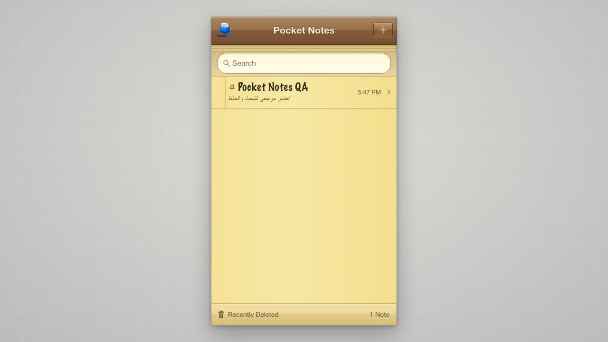
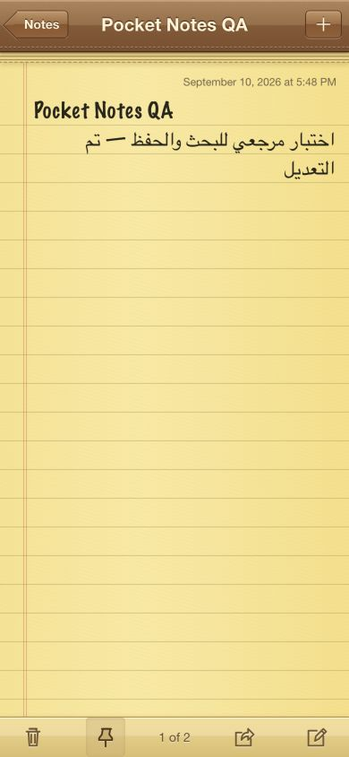

# Pocket Notes — نتائج الفحص الحالية

تاريخ الفحص: 10 سبتمبر 2026. هذه النتائج تخص النسخة المعدّلة في هذه المهمة. الملف `VALIDATION_ORIGINAL.md` سجل تاريخي فقط.

## المشروع والتغييرات

- فُك الأرشيف في مجلد مستقل دون تعديل ZIP أو الصورة الأصليين.
- بقي المشروع React 19 + TypeScript 5.9 + Vite، مع نفس التصميم الكلاسيكي وآلية الحفظ، ودون مكتبات تشغيل جديدة.
- أصبحت الهوية **Pocket Notes** في رأس القائمة والمنطقة الرئيسية والعنوان وmetadata وpackage وManifest.
- استُخدمت الصورة المرفقة كاملة بنسبها الأصلية: favicon PNG/ICO، وApple 180، وPWA 192/512، ونسختا maskable. المصدر في `assets/branding/pocket-notes-original.png` مطابق للصورة الأصلية باختبار SHA-256.
- تحديث Vite من 7.1.5 إلى 7.3.6؛ `npm audit` أعاد صفر ثغرات معروفة وقت الفحص.
- حماية مغادرة الصفحة فقط عند وجود تغييرات لم تُحفظ بسبب فشل التخزين؛ تزول بعد نجاح Retry.
- إصلاح نتيجة النسخ المتأخرة بعد إلغاء النافذة وإعادة فتحها؛ الطلب القديم لا يغلق النافذة الجديدة ولا يغير حالة طلبها.
- إبقاء مفتاح البيانات `classic-pocket-notes:v1` وصيغة الإصدار 2 وترحيل الإصدار 1 وبادئة cache القديمة للتوافق وتنظيف الإصدارات السابقة.
- تحسين `.gitignore`؛ نشر Pages اختياري عبر `ENABLE_PAGES=true`، بينما CI يعمل دون تفعيل الاستضافة.

## فحص المرجع والنسخة المعدّلة

المرجع: [Classic Pocket Notes](https://classic-pocket-notes.dyoth69.chatgpt.site). فُحص في متصفح Codex بالتفاعل المباشر، دون نسخ شفرة أو أصول منه. بدأت جلسة المرجع بقائمة فارغة، واستُخدم نص اختبار مصطنع.

| الخطوة | الاختبار | المرجع | النسخة المعدلة |
| --- | --- | --- | --- |
| 1 | قائمة فارغة ومحرر جديد | نجح | نجح |
| 2 | نص عربي وإنجليزي وعنوان أول سطر | نجح | نجح |
| 3 | التعديل والحفظ بعد إعادة التحميل | نجح | نجح |
| 4 | البحث داخل المحتوى | نجح بالنص العربي | نجح بالإنجليزية في الواجهة؛ العربية ضمن اختبارات المنطق |
| 5 | التثبيت واستمراره بعد التحميل | نجح | نجح؛ وتقدمت المثبتة على ملاحظة أحدث |
| 6 | حالة الأحرف والمسافات والبحث بلا نتائج | لم يُفحص تفصيليًا | نجح بالواجهة |
| 7 | تأكيد الحذف والنقل إلى Recently Deleted | نجح | نجح؛ إلغاء الحذف اختُبر أيضًا |
| 8 | المحذوف للقراءة فقط و30 يومًا متبقية | نجح | نجح |
| 9 | الاستعادة مع بقاء النص والتثبيت | نجح | نجح، ثم أُعيد التحميل للتحقق |
| 10 | مشاركة النظام | استُدعي الزر؛ نافذة النظام غير قابلة للتحقق في هذه البيئة | منطق النجاح والإلغاء والفشل اختُبر آليًا؛ لم يُرسل محتوى إلى تطبيق خارجي |
| 11 | النسخ اليدوي عند رفض المشاركة والحافظة | لم يُتحقق منه بالواجهة | نجح في إطار يرفض الإذنين؛ ظهر النص كاملًا ومحددًا |
| 12 | هاتف 390×844 | المحرر فُحص بصريًا | القائمة والمحرر فُحصا بصريًا |
| 13 | 320×568 وأفقي 667×375 وسطح مكتب 1280×720 | لم تُفحص جميعها | نجح؛ لا تجاوز أفقي والأدوات داخل الشاشة |

كانت ميزات البحث والتثبيت والمشاركة والاستعادة موجودة أصلًا في المشروع، ولم تُعد كتابتها. لم يظهر تصنيف مستقل أو إعدادات إضافية في واجهات المرجع المفحوصة.

## الاختبارات الآلية

على Node.js 22.23.2، نجح `npm ci` ثم `npm run check`:

- **26/26** اختبار منطق: CRUD وUnicode والحفظ والترحيل والبيانات التالفة وتعارض التبويبات والبحث والتثبيت والحذف النهائي وحدود الثلاثين يومًا والمشاركة والنسخ.
- فحص TypeScript وبناء Vite نجحا؛ Service Worker يحتوي قائمة **17** ملفًا محليًا فعلية.
- **10/10** اختبارات بناء: الروابط والأيقونات وmetadata، ومسارات `/` و`/pocket-notes/` والمسار القديم والمسار المتداخل، وcache وتحديثه وعزله لكل مسار.
- كل PNG فُك بنجاح بالمقاس المطلوب؛ ICO يتضمن 16/32/48. أيقونات maskable معتمة والمحتوى داخل دائرة الأمان المركزية ذات نصف قطر 40%.
- ملفات `tests/*.html` غير موجودة ضمن ناتج الإنتاج.
- فُحصت مراجع GitHub Actions المثبتة فعليًا عبر GitHub API وصياغة workflow وصلاحياته وشروطه. فحص المصدر لم يكشف أسرارًا أو ملفات اعتماد.

## حالات الفشل في المتصفح

صفحة `tests/failures.html` خاصة بالتطوير وتغير طرق المتصفح مؤقتًا داخل إطارها:

1. تعديل محفوظ عادي → `beforeunload.defaultPrevented=false`.
2. فرض فشل الكتابة ثم تعديل النص → ظهر تحذير الحفظ وبقي النص؛ `defaultPrevented=true`.
3. استعادة الكتابة والضغط على Retry → اختفى التحذير؛ `defaultPrevented=false`. ظهرت النسخة المستعادة في إطار آخر من الأصل نفسه.
4. نسخ مؤجل ثم إلغاء النافذة وإعادة فتحها ونسخ ثانٍ → إكمال الأول أبقى النافذة الثانية مفتوحة ومشغولة؛ إكمال الثاني أغلقها وأظهر Copied.
5. أُعيدت طرق التخزين والحافظة الأصلية بعد الاختبار. النسخ المؤجل محاكاة في الذاكرة، لا إرسال إلى حافظة النظام.

## العمل دون اتصال وConsole

اختُبر الإنتاج على أصل محلي مستقل لتجنب caches لمشروعات سابقة. بعد تحميل التطبيق أُوقف خادم المعاينة تمامًا، وأكد `curl` عدم توفره. نجحت إعادة تحميل التطبيق من Service Worker وقراءة الملاحظات وتعديل ملاحظة دون اتصال ثم إعادة تحميلها مع بقاء التعديل. أُعيد تشغيل الخادم بعد الاختبار. سجل Console للإنتاج لم يتضمن أخطاء أو تحذيرات مرتبطة بالتطبيق خلال الفحص.

## الأدلة البصرية

فُحص المحرر في المرجع والنسخة بالحجم نفسه 390×844 وبالنص نفسه؛ الورق والخطوط والأدوات والتفاف النص متوافقة بصريًا، مع اختلاف الوقت وعدد ملاحظات الاختبار. تغيّر رأس القائمة بالاسم والأيقونة المطلوبين.

| المرجع — 390×844 | النسخة المعدّلة — 390×844 |
| --- | --- |
|  |  |

لقطات إضافية: [قائمة الهاتف](screenshots/pocket-notes-mobile.png)، [عرض 320](screenshots/pocket-notes-320.png)، [الوضع الأفقي](screenshots/pocket-notes-landscape.png).

## الحدود والاختلافات المتبقية

- لا ادعاء بتطابق 100%؛ النتائج تخص الواجهات والسلوك المتاح للتحقق.
- لم تُختبر عملية تثبيت PWA أو لوحة مفاتيح iOS/Android على هاتف فعلي؛ ملفات الأيقونات والتثبيت فُحصت، والأحجام اختُبرت بمحاكاة أبعاد المتصفح.
- لم يُرسل محتوى بالمشاركة الأصلية إلى تطبيق خارجي. الحذف النهائي وانتهاء الثلاثين يومًا اختُبرا بالمنطق؛ لم يُنفذ حذف نهائي في واجهة المرجع.
- حماية المغادرة تعتمد على المتصفح، ولا تمنع فقدان الذاكرة عند إنهاء النظام للتطبيق بالقوة.
- البيانات محلية لكل نطاق ومتصفح. تغيير عنوان الاستضافة لا ينقل ملاحظات المرجع تلقائيًا؛ الحفاظ على المفتاح يضمن التوافق على الأصل نفسه.
- رفع المصدر إلى GitHub منفصل عن نشر موقع عام. انظر `DELIVERY.md` لحالة التسليم الفعلية.
